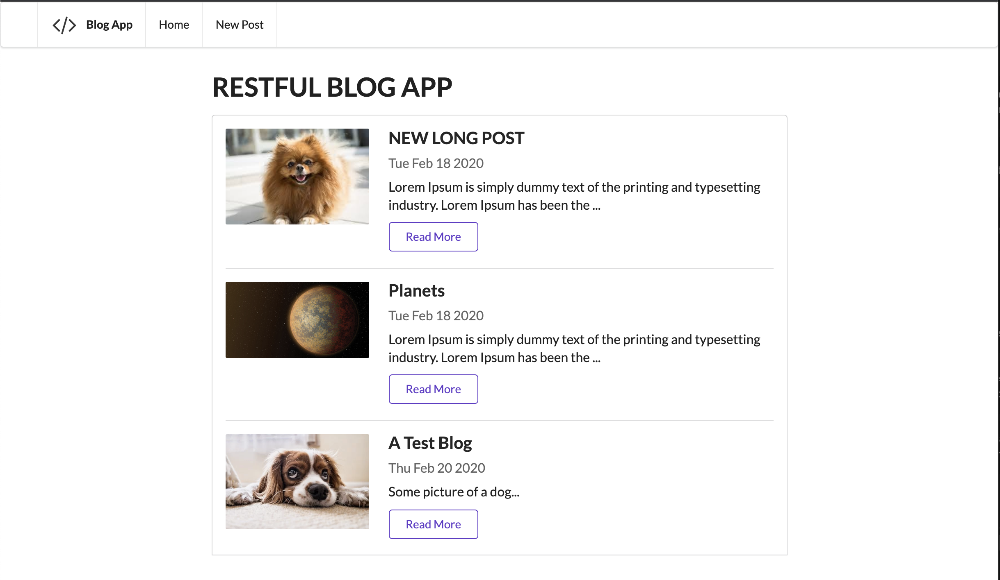
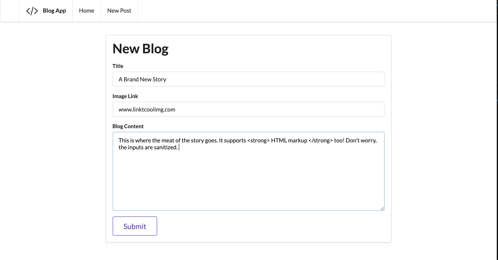
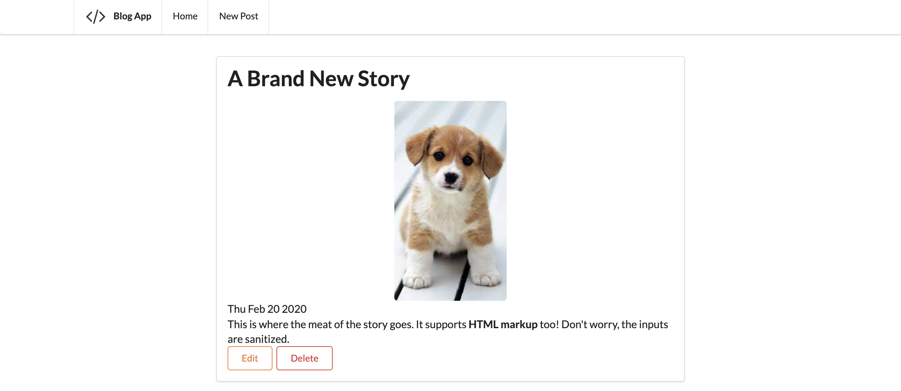

# rest-blog-app

# Sample Blog Web App Using NodeJS, Semantic UI, Express, and Mongo

### This app supports all CRUD functionality.
### Follows RESTFUL Conventions
### Uses EJS. 
### Posts support HTML markup.  

### Index Page

### Create Page

### Edit & Delete Page

# Prerequisiites 
Have a MongoDB service linked to the app. Developed with MongoDB Community Edition Version 4.2

# To Run

On Mac, with MongoDB Community installed :
- brew services start mongodb-community
- npm install
- node app.js
